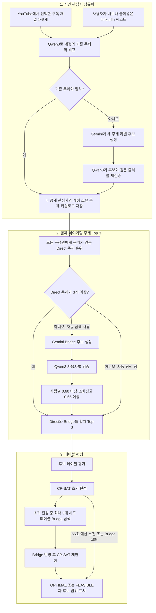

# 공통 관심사 산정

## 계정 서비스 아키텍처

아래 흐름은 원본 [Architecture.png](Architecture.png)를 계정 서비스에 맞춰 구체화한 [Architecture-updated.png](Architecture-updated.png)의 세 단계입니다. 로컬 Demo 파이프라인은 다음 절의 별도 구현을 그대로 유지합니다.

### 1. 개인 관심사 정규화

1. YouTube는 사용자가 선택한 구독 채널 1~5개, LinkedIn은 사용자가 직접 내보내 붙여넣은 텍스트만 입력으로 받습니다. 자동 LinkedIn 수집이나 다른 사용자의 데이터는 사용하지 않습니다. 연락처·식별정보와 지원하지 않는 민감 근거는 저장 대상에서 제외합니다.
2. Qwen3가 원문을 해당 계정의 기존 비공개 주제 카탈로그와 비교합니다. 0.75 이상 일치하는 항목은 기존 주제로 정규화합니다. 이 임계값은 사용자 평가로 보정할 임시 기준입니다.
3. 기존 주제와 일치하지 않는 원문에만 Gemini가 새 라벨 후보를 만듭니다. Qwen3가 후보 라벨을 원본 출처와 다시 비교해 0.75 이상으로 검증해야 저장합니다. Gemini 키는 이 미일치 분기에만 필요합니다. YouTube 분석은 최대 60초로 제한하며, 모델 오류나 빈 결과에서는 선택한 채널 이름에 직접 근거한 시청 키워드 1개를 비공개로 저장합니다. 이 경로의 결과에는 원문 기반 대체 결과임을 기록하고 Qwen 검증 모델을 표시하지 않습니다. LinkedIn 텍스트 정규화에서는 모델 오류가 나면 저장하지 않습니다.
4. 관심사와 원본 출처 근거를 기본 비공개로 저장하고, 새 라벨은 그 계정 소유 카탈로그에만 추가합니다. 프로필 저장 시 신뢰할 수 있는 저장 관심사에서 더 이상 참조하지 않는 주제를 정리하고, 프로필 삭제 시 카탈로그를 함께 삭제합니다. 전역 카탈로그나 무제한 주제 생성은 없습니다.
5. 한 요청은 새 원문 항목 최대 40개, 프로필은 관심사 최대 100개로 제한합니다. YouTube는 1~5개 채널을 선택하며 정상 저장 응답에는 최소 1개의 키워드가 포함됩니다. 재분석에서 기존 키워드를 재사용하면 새 관심사 수는 0일 수 있으나 확인한 키워드는 반환합니다. 인증·저장 한도·원문 변경·취소 오류는 성공 처리하지 않습니다.

### 2. 함께 이야기할 주제 Top 3

1. 먼저 모든 선택 구성원에게 실제 공유 근거가 있는 Direct 주제를 순위화합니다.
2. Direct 주제가 3개 미만이고 사용자가 기본 활성화된 자동 탐색을 끄지 않았을 때만 Gemini가 Bridge 후보를 만듭니다. 입력은 사람당 대표 공개 관심사 최대 6개이며 비공개·회피 항목은 제외합니다.
3. Qwen3는 각 후보가 모든 사람에게 0.60 이상 관련되는지 검증하고, 사용자별 점수의 조화평균이 0.65 이상인 후보만 통과시킵니다. Gemini의 confidence는 점수에 쓰지 않습니다.
4. Direct와 검증된 Bridge를 다시 순위화해 최대 3개를 표시합니다. Bridge 생성이나 검증이 실패하면 가능한 Direct 결과를 유지합니다.

### 3. 최적 그룹 추천

1. 공유 관심사로 후보 테이블을 평가하고 CP-SAT 초기 편성을 구합니다. 후보 조합이 16,000개 이하면 전수 평가하고, 초과하면 계산 범위를 제한합니다.
2. 초기 편성의 최대 3개 시드 테이블에만 Bridge 탐색을 실행한 뒤 검증된 주제를 반영해 CP-SAT을 다시 실행합니다. 모든 조합에 Gemini를 호출하지 않습니다.
3. 전체 편성 요청은 55초 예산을 공유합니다. Bridge 검증이나 재편성이 예산 안에 끝나지 않으면 초기 Direct 편성을 반환합니다.
4. 결과에는 solver의 `OPTIMAL` 또는 `FEASIBLE` 상태와 전체/제한 후보 범위를 함께 표시합니다. 제한 후보에서 얻은 `OPTIMAL`은 그 탐색 범위 안의 최적해이며 전역 최적을 뜻하지 않습니다.

## 로컬 Demo 파이프라인

현재 Demo는 `backend/demo-analysis.mjs`와 `shared/demo-analysis.ts`의 파이프라인을 사용합니다. 아래 기존 서비스의 쌍 비교·complete-link 소그룹 로직과 별도의 구현입니다.

1. 실제 YouTube metadata와 LinkedIn 문서의 원문·출처 ID를 정리합니다. LinkedIn OIDC의 이름만 있는 기본 정보는 관심사 분석에서 제외합니다. 한 번에 최대 3,000개 항목을 처리하며 초과 시 재생목록을 나누어 가져오도록 안내합니다. 원문 출처를 보존하며 임베딩 입력은 항목당 최대 1,800자·256토큰으로 제한합니다.
2. 입력 원문과 공개된 32개 한국어·영어 주제 설명을 실제 Qwen3-Embedding-0.6B ONNX q8 모델로 임베딩합니다. 마지막 토큰 pooling, L2 정규화, 최대 256토큰을 사용합니다. 짧은 분류용 taxonomy는 코드에서 확인·수정할 수 있습니다.
3. 코사인 유사도와 원문에서 명시한 키워드로 관심사 지지도를 계산합니다. 순수 의미 후보는 임시 임계값 0.57을 적용하며, 개인 점수는 근거 강도·근거 수·출처 수를 합산한 상대 점수입니다. 추출 결과에 원문 ID를 보존합니다. 사전학습 모델과 이 점수는 실제 사회적 결과에 맞춰 보정된 예측 모델이 아닙니다.
4. 선택한 사람별 주제 지지도를 구성하고 모든 사람에게 원문 근거가 있는 주제만 공통 관심사로 반환합니다. 알려진 상위 주제로 다른 세부 관심사를 연결할 수 있으며, `Exact / Category / Semantic`을 상세에서 구분합니다. 공통 점수는 구성원 최소·평균 지지도와 실제 근거 강도를 반영합니다.
5. 모든 가능한 후보 테이블을 평가합니다. Topic Strength는 공통 관심사 Top-3 강도, Member Balance는 구성원 기여의 균형, Topic Breadth는 주제 분야의 다양성, Pair Coverage는 근거가 연결된 구성원 쌍의 비율입니다. Group Utility는 이 네 항목의 가중합입니다.
6. OR-Tools CP-SAT의 집합 분할 모델에서 각 참가자가 정확히 하나의 테이블에 들어가도록 제약합니다. 참가자 최대 24명, 테이블 크기 3~5명, 최소 테이블 수와 균형 있는 인원 분포를 사용합니다. 24명/4명은 10,626개 4인 후보를 평가합니다.
7. 전체 품질 우선, 그룹 간 균형 우선, 이전 편성에 없던 연결 우선의 세 목적을 차례로 최적화합니다. 이전 편성 전체를 제외하는 제약으로 중복 결과를 막습니다. 각 실행 기본 8초 제한, 후보 전수 평가 여부와 `OPTIMAL / FEASIBLE` 상태를 결과에 보존합니다. 따라서 세 결과는 같은 목적함수의 엄밀한 순위 1~3위가 아니라 서로 다른 목적의 추천 후보입니다.

그룹에 전체 공통 주제가 없으면 공통 관심사를 꾸며내지 않고 빈 목록을 표시합니다. 점수는 관계 성공 확률이 아니며, 참여자 전원 배정·테이블 크기·중복 배정을 서버에서 다시 검사합니다.

## 입력과 출력

사용자가 직접 확인하고 공유를 허용한 관심사만 입력합니다. 출력은 일치하는 항목과 의미적으로 연결되는 후보를 구분하고, 각 참여자의 원문을 제시합니다. 사람의 전체 프로필 유사도 하나로 관심사 근거를 대체하지 않습니다.

1. 별칭 정규화: DAY6 / 데이식스 / 데식처럼 알려진 별칭을 동일하게 묶습니다.
2. 정확한 공통점: 서로 다른 두 명 이상이 동일 항목을 가지고 있으면 표시합니다.
3. 관련 분야: 명시적 분류 규칙으로 일본 여행, 데이터 분야 등의 접점을 제시합니다.
4. 의미 비교: 서로 다른 사용자의 같은 분야 관심사를 Qwen3-Embedding-0.6B (ONNX q8)로 임베딩하고 정규화 벡터의 내적으로 코사인 유사도를 구합니다.
5. 0.75 이상의 쌍을 연결 후보로 표시합니다. 임시 기준이므로 평가 데이터로 조정해야 합니다. 점수를 확률로 표시하지 않습니다. 쌍별 결과를 무조건 합쳐 전체 모임의 공통점이라고 주장하지 않습니다.
6. 기본 결과는 참여자 수 우선, 같은 수이면 정확한 공통점을 먼저 표시합니다. Qwen3 후보도 같은 랭킹 기준에 포함합니다. 모든 유효한 쌍은 소그룹 점수 계산에 사용합니다.

## 왜 Two-Tower / TorchRec / PinSage를 먼저 사용하지 않는가

Two-Tower는 query–candidate의 관계를 학습하는 구조이며 상호작용 정답과 음성 예제가 필요합니다. 새 사용자가 직접 넣은 관심사의 의미를 비교하는 일에는 사전학습 문장 임베딩이 바로 사용 가능합니다. TorchRec는 대규모 임베딩 테이블의 분산 학습을 돕는 라이브러리로, 앱에 바로 넣을 완성된 취향 모델이 아닙니다. PinSage는 그래프 연결과 항목 특징으로 학습한 item embedding을 만듭니다. 연결이 없는 새 사용자에게 무조건 효과적인 해결책이 아닙니다.

FAISS는 이미 만든 벡터의 검색을 가속하며 의미를 학습하거나 두 사람의 공통 주제를 생성하지 않습니다. 현재 모임 내부의 소수 관심사 비교에는 직접 내적 계산이 충분합니다. 수많은 사용자나 주제의 후보 검색을 추가할 때 검토합니다.

## 이후 학습 계획

사용자가 동의한 경우에만 후보가 적절했는지 확인하는 피드백을 모읍니다. 연구용 평가셋은 동일 항목 / 관련 분야 / 무관 항목을 구분하고 한국어 표현, 별칭, 서로 반대인 선호를 포함합니다. 사용자 단위로 학습·평가를 나눠 누출을 방지합니다. 정확한 공통점의 precision과 관련 후보 precision@k, 그룹 참여자 coverage를 따로 평가합니다.

충분한 피드백을 확보한 뒤 user–topic Two-Tower 또는 후보 reranker를 학습할 수 있습니다. 두 사람에게 각각 높은 주제를 고르고, 그룹에서는 참여자 coverage와 원문 근거를 유지합니다. 이 단계가 기존 임베딩 기준을 실제로 개선하는지 비교한 다음 도입합니다.

## LLM 역할

수시 자유 입력에서 관심사 후보를 추출하고 사용자가 확인하게 하는 역할입니다. 연결 후보를 보조 제안할 수 있지만 공유 원문의 ID를 근거로 요구합니다. 근거 ID 검사만으로 의미적 환각이 완전히 제거되지는 않습니다. 대화 질문은 생성하지 않습니다.

개인정보 필터는 연락처·식별번호 패턴을 차단하는 최소 구현입니다. 정치·건강 등 모든 민감 속성을 자동 판별하는 모델은 아닙니다. 자동 수집이나 비공개 관심사 추론을 하지 않습니다.

## Qwen3 실행

논문 Section 2에 따라 마지막 토큰의 은닉 상태를 사용하고 L2 정규화합니다. 현재는 짧은 관심사 사이의 대칭 비교이므로 두 입력에 동일한 일반 텍스트 형식을 사용하며 검색용 query instruction을 한쪽에만 붙이지 않습니다. 향후 user–topic 검색에서는 작업 지시문을 query에만 붙여 별도 평가합니다. 입력 길이는 128 토큰으로 제한합니다. 0.75는 Qwen3용 미보정 후보 임계값이며 사용자 검증을 대체하지 않습니다.

공개 사이트에서는 Web Worker의 WASM q8 모델이 실행됩니다. 첫 다운로드는 약 614MB이며 기기 메모리에 따라 실패할 수 있어 PC를 권장합니다. 실패 시 정확한 일치/분류 결과가 유지됩니다. 모델 파일은 브라우저 캐시에 보관될 수 있지만 계산한 취향 벡터는 비교 종료/중단 때 폐기합니다. Node 로컬 서버도 동일 모델과 pooling을 사용합니다.

계정 서비스의 Vercel 함수는 `api/app.ts`에 연결된 하나의 네이티브 Qwen 런타임으로 소스 정규화, 선택형 Direct 의미 비교, Bridge 검증을 수행합니다. 같은 함수 인스턴스에서는 준비된 모델을 재사용하며 별도의 `semanticPairs` 실행 서버를 요구하지 않습니다. 원격 Turso 배포 전에는 `0008_interest_topics` 마이그레이션을 적용해야 하고, 로컬 SQLite는 시작 시 이를 자동 적용합니다.

좋아함/회피/해보고 싶음을 입력 단계에서 구분합니다. 회피 항목을 긍정 선호 벡터에 넣지 않습니다. 공유한 회피 항목과 동일한 canonical/category 항목은 해당 사용자가 참여하는 추천에서 제외하지만 의미적으로 유사한 모든 회피를 감지한다고 주장하지 않습니다.

## 소그룹 편성
공유 긍정 취향의 항목별 최고 연결 가중치를 합산하고 항목 수로 나눈 뒤 양쪽 사용자의 평균을 계산합니다. 같은 항목 1, 분야 규칙 0.6, AI 임베딩 후보는 코사인 유사도입니다. 가장 높은 최소 쌍 유사도를 갖는 묶음부터 병합하며, 모든 쌍에 양의 접점이 있어야 합니다. 최대 인원 3~6명을 선택할 수 있으며 연결이 없는 사람은 배정을 보류합니다. 특정 인원수를 강제로 맞추거나 성공 확률을 예측하는 방식은 아닙니다.
